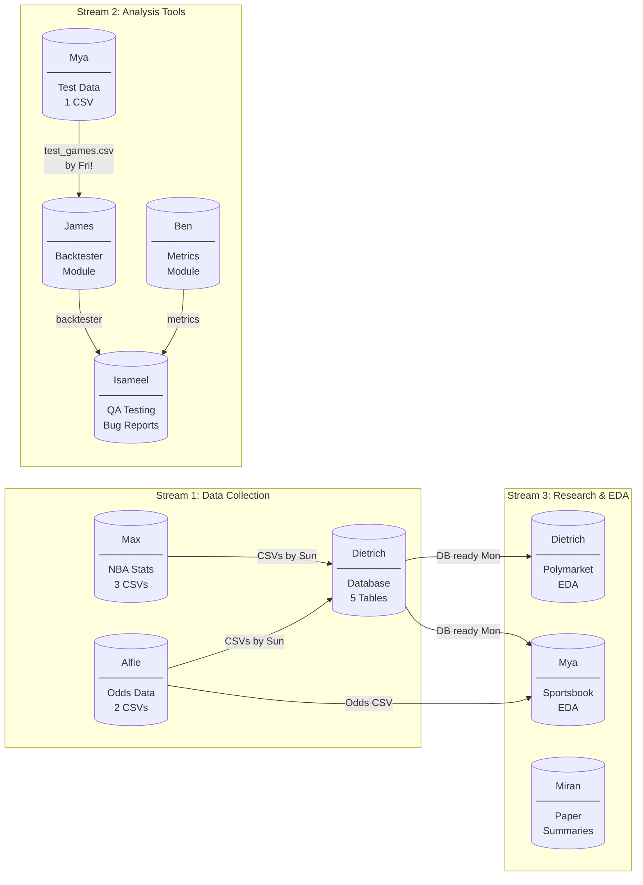
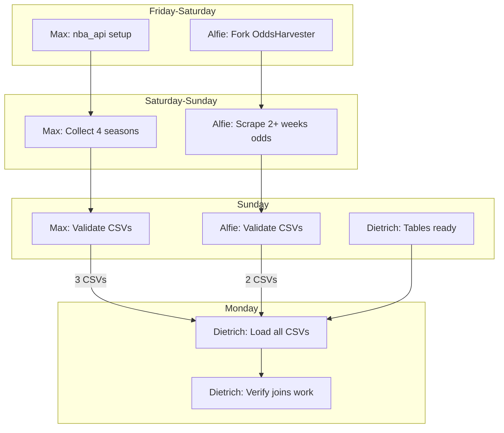
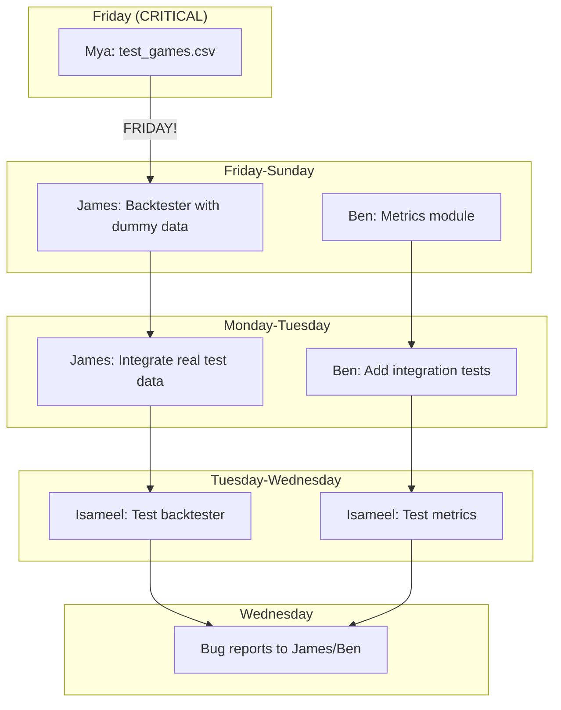
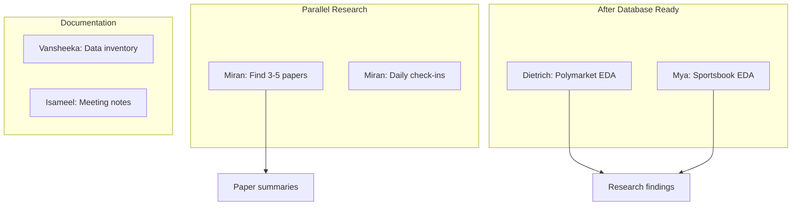

# Week 1 Sprint: Feb 6-12, 2026

**Deadline:** Thursday Feb 12 (Presentation Day)
**Coordinator:** Miran ([daily reports](progress_reports/week1.md))

---

## Dependency Overview

Three parallel streams converge into the final deliverable. Each node shows **who delivers what to whom**.



---

## Timeline (Gantt)

```mermaid
gantt
    title Week 1 Sprint Timeline
    dateFormat  YYYY-MM-DD
    axisFormat  %a %d

    section Data Collection
    Max: NBA stats collection       :max1, 2026-02-06, 3d
    Max: Validate & send CSVs       :max2, after max1, 1d
    Alfie: OddsHarvester setup      :alf1, 2026-02-06, 1d
    Alfie: Scrape odds data         :alf2, after alf1, 2d
    Alfie: Validate & send CSVs     :alf3, after alf2, 1d

    section Database
    Dietrich: Create tables         :diet1, 2026-02-06, 2d
    Dietrich: Load CSVs             :diet2, after max2, 1d
    Dietrich: Verify joins          :diet3, after diet2, 1d

    section Analysis Tools
    Mya: Test data generator        :crit, mya1, 2026-02-06, 1d
    James: Backtester with dummy    :jam1, 2026-02-06, 2d
    James: Integrate test data      :jam2, after mya1, 1d
    James: Document interface       :jam3, after jam2, 1d
    Ben: Metrics module             :ben1, 2026-02-06, 3d
    Ben: Integration + docs         :ben2, after ben1, 1d
    Isameel: Test backtester        :isa1, after jam2, 2d
    Isameel: Test metrics           :isa2, after ben1, 2d

    section EDA & Research
    Dietrich: Polymarket EDA        :diet4, after diet3, 2d
    Mya: Sportsbook EDA             :mya2, after alf3, 2d
    Miran: Find papers              :mir1, 2026-02-06, 3d
    Miran: Write summaries          :mir2, after mir1, 2d

    section Coordination
    Miran: Daily check-ins          :mir3, 2026-02-06, 7d
    Vansheeka: Data inventory       :van1, 2026-02-08, 3d
    Isameel: Meeting notes          :isa3, 2026-02-06, 7d

    section Milestones
    Test data to James              :milestone, crit, m1, 2026-02-07, 0d
    CSVs to Dietrich                :milestone, m2, 2026-02-09, 0d
    Database ready                  :milestone, m3, 2026-02-10, 0d
    Presentation                    :milestone, crit, m4, 2026-02-12, 0d
```

---

## Handoff Schedule

| Day | Who | Delivers | To | Format |
|-----|-----|----------|-----|--------|
| **Fri 6** | Mya | `test_games.csv` | James | CSV with 20+ rows |
| **Sun 8** | Max | 3 NBA CSVs | Dietrich | `team_stats`, `player_stats`, `game_logs` |
| **Sun 8** | Alfie | 2 Odds CSVs | Dietrich | `matches`, `odds` |
| **Mon 9** | Dietrich | Database ready | Team | Railway PostgreSQL |
| **Tue 10** | James | Backtester | Isameel | Python module |
| **Tue 10** | Ben | Metrics | Isameel | Python module |
| **Wed 11** | Isameel | Bug reports | James/Ben | Markdown |
| **Thu 12** | All | Presentation | Tan | Ready |

---

## Stream Details

### Stream 1: Data Collection → Database



**Key Join Column:** `team_abbr` (3-letter codes: LAL, BOS, MIA, etc.)

---

### Stream 2: Analysis Tools → Testing



**Critical Path:** Mya's test data blocks James. Must deliver Friday.

---

### Stream 3: Research & EDA



---

## Status Key

| Symbol | Meaning |
|--------|---------|
| :white_check_mark: | Completed |
| :hourglass_flowing_sand: | In Progress |
| :x: | Blocked |
| :warning: | At Risk |

---

## Daily Status (Miran updates)

### Friday Feb 6
| Person | Status | Notes |
|--------|--------|-------|
| Max | | |
| Alfie | | |
| Dietrich | | |
| James | | |
| Ben | | |
| Mya | | |
| Isameel | | |
| Vansheeka | | |

### Saturday Feb 7
| Person | Status | Notes |
|--------|--------|-------|
| Max | | |
| Alfie | | |
| Dietrich | | |
| James | | |
| Ben | | |
| Mya | | |
| Isameel | | |
| Vansheeka | | |

### Sunday Feb 8
| Person | Status | Notes |
|--------|--------|-------|
| Max | | |
| Alfie | | |
| Dietrich | | |
| James | | |
| Ben | | |
| Mya | | |
| Isameel | | |
| Vansheeka | | |

---

## Escalation Path

**Blocked?** Tell Miran immediately → Miran escalates to Tan if critical.

**Missing handoff?** Don't wait. Use dummy data (see task briefs for formats).
