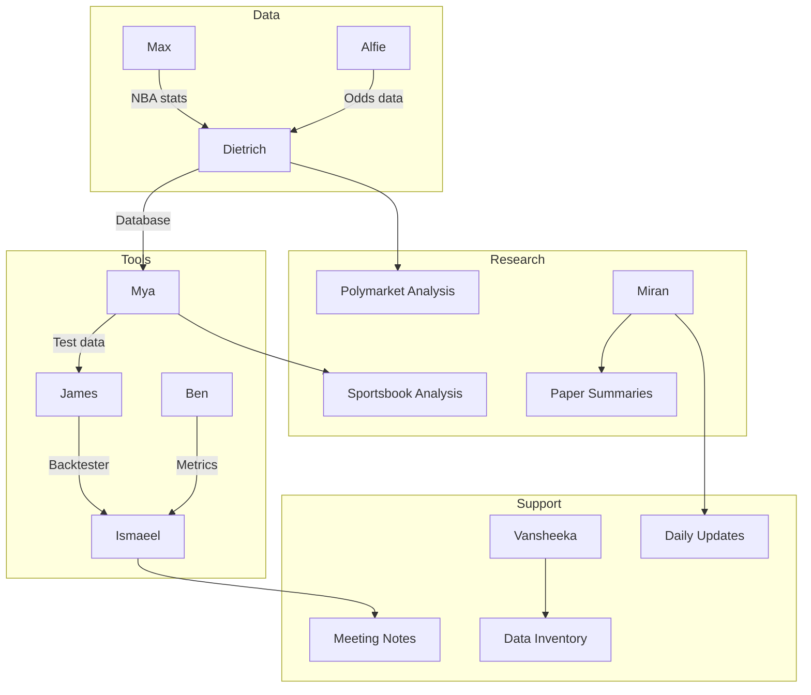
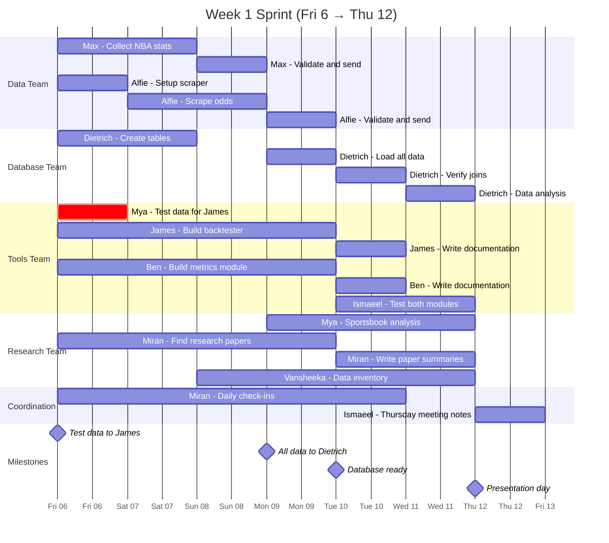
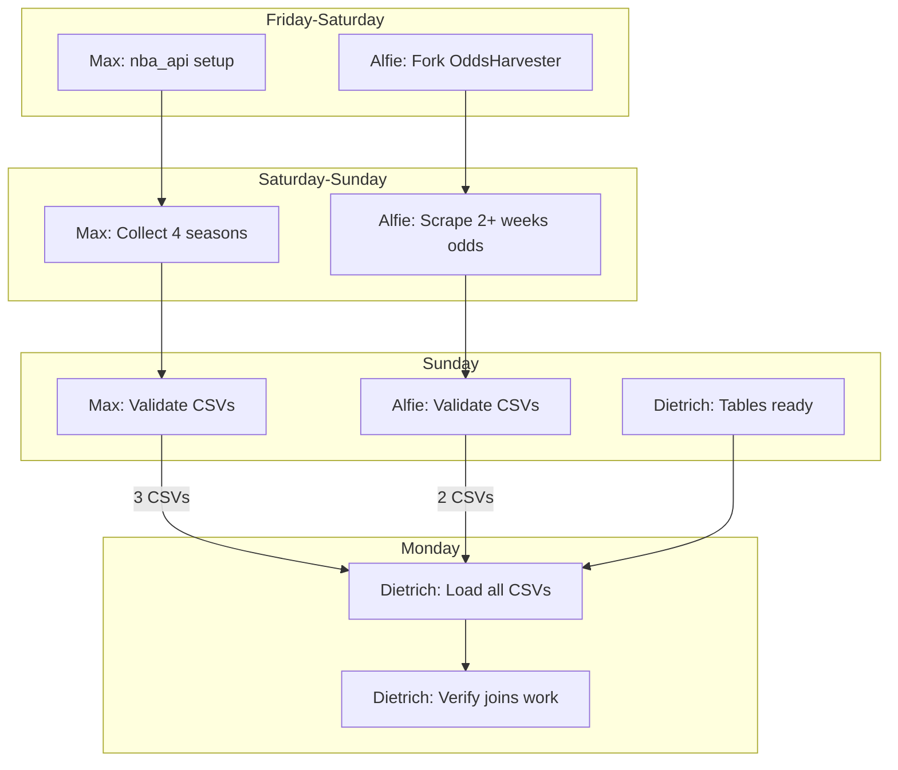

# Week 1 Sprint: Feb 6-12, 2026

**Deadline:** Thursday Feb 12 (Presentation Day)
**Coordinator:** Miran (updates Daily Status tables below)

---

## Who Delivers What to Whom

**Key Deadlines:**

- **Friday:** Mya sends test data to James
- **Sunday:** Max and Alfie send data to Dietrich
- **Tuesday:** James and Ben send code to Ismaeel for testing

---

## Timeline (Gantt)

---

## Handoff Schedule

| Day | Who | Delivers | To | Format |
|-----|-----|----------|-----|--------|
| **Fri 6** | Mya | `test_games.csv` | James | CSV with 20+ rows |
| **Sun 8** | Max | 3 NBA CSVs | Dietrich | `team_stats`, `player_stats`, `game_logs` |
| **Sun 8** | Alfie | 2 Odds CSVs | Dietrich | `matches`, `odds` |
| **Mon 9** | Dietrich | Database ready | Team | Railway PostgreSQL |
| **Tue 10** | James | Backtester | Ismaeel | Python module |
| **Tue 10** | Ben | Metrics | Ismaeel | Python module |
| **Wed 11** | Ismaeel | Bug reports | James/Ben | Markdown |
| **Thu 12** | All | Presentation | Tan | Ready |

---

## Stream Details

### Stream 1: Data Collection → Database

**Key Join Column:** `team_abbr` (3-letter codes: LAL, BOS, MIA, etc.)

---

### Stream 2: Analysis Tools → Testing

**Critical Path:** Mya's test data blocks James. Must deliver Friday.

---

### Stream 3: Research & EDA

---

## Status Key

| Symbol | Meaning |
|--------|---------|
| :white_check_mark: | Completed |
| :hourglass_flowing_sand: | In Progress |
| :x: | Blocked |
| :warning: | At Risk |

---

## Daily Status (Miran updates)

### Friday Feb 6

| Person | Status | Notes |
|--------|--------|-------|
| Max | ✅ | Linux compatibility errors observed but have been resolved |
| Alfie | ⏳ | Starting Saturday |
| Dietrich | ⏳ | Waiting for data|
| James | ⏳ | Haven't started due to illness|
| Ben | ✅ | Finished task with dummy data, waiting on James for real data |
| Mya | ✅ | Test Data Generator + Sportsbook EDA Completed |
| Ismaeel | ✅ | Completed set up on VS. Created dummy back tester input and output |
| Vansheeka | ⏳ | Still setting up environment |

### Saturday Feb 7

| Person | Status | Notes |
|--------|--------|-------|
| Max | | |
| Alfie | ✅ | Woorked on 2010s data, on track for others |
| Dietrich | ⏳ | Still waiting |
| James | ⏳ | Still ill |
| Ben | ✅ | Path issues |
| Mya | ✅ | Waiting for Alfie |
| Ismaeel | ✅ | Everything going smoothly |
| Vansheeka | | |

### Sunday Feb 8

| Person | Status | Notes |
|--------|--------|-------|
| Max | | |
| Alfie | ✅ | Handed over to Diestrich|
| Dietrich | | |
| James | ⏳ | Still ill |
| Ben | ✅ | Updated log |
| Mya | | |
| Ismaeel | | |
| Vansheeka | | |

---

## Escalation Path

**Blocked?** Tell Miran immediately → Miran escalates to Tan if critical.

**Missing handoff?** Don't wait. Use dummy data (see task briefs for formats).
